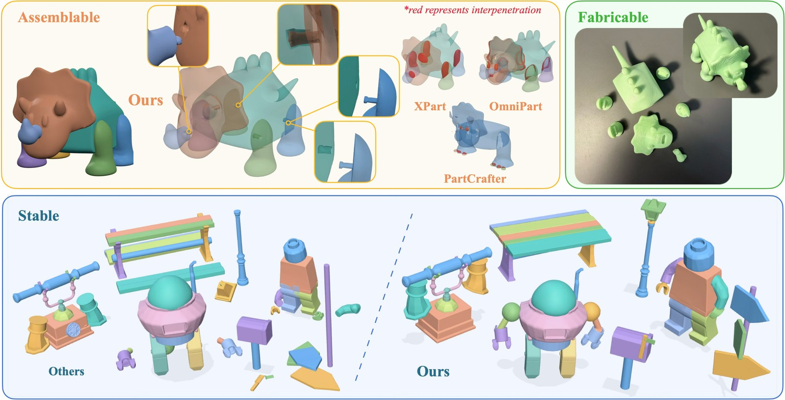
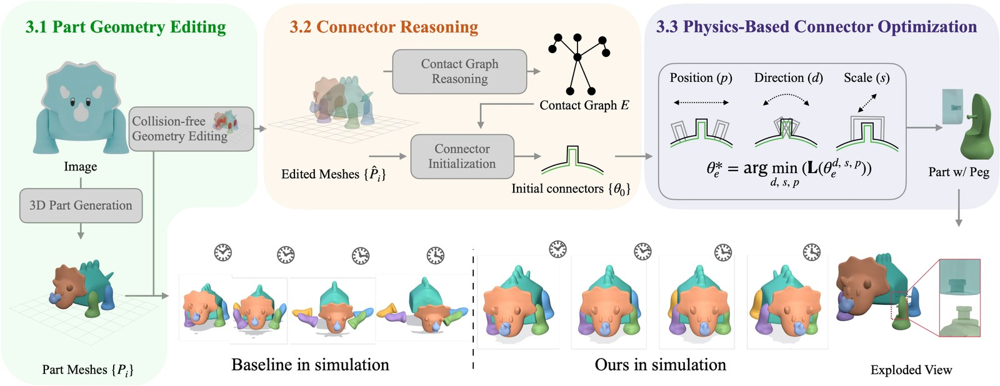
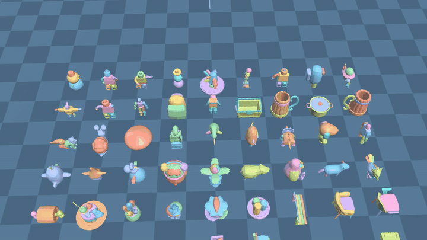
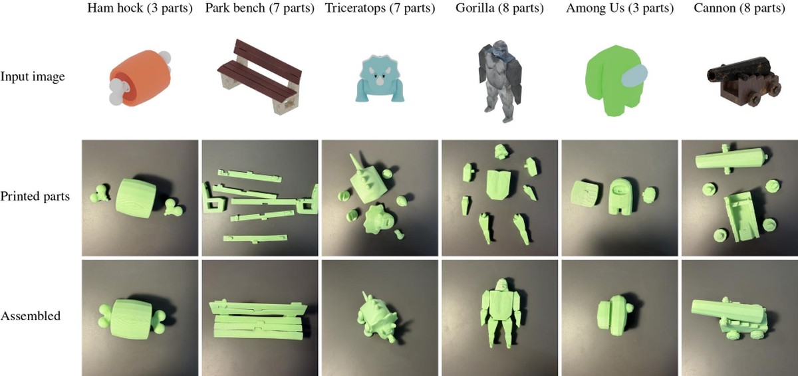

<div align="center">


# SNAP3D

### Physically Grounded 3D Parts for Assembly from a Single Image

[Yu-Rou Tuan](https://lucytuan.github.io/) &nbsp;·&nbsp;
[Hao-Tang Tsui](https://henrytsui000.github.io/) &nbsp;·&nbsp;
[Nicolás Ugrinovic](https://nicolasugrinovic.github.io/) &nbsp;·&nbsp;
[Kris Kitani](https://kriskitani.github.io/) &nbsp;·&nbsp;
[Xiaoxuan Ma](https://shirleymaxx.github.io/)

**Carnegie Mellon University**

[](https://lucytuan.github.io/SNAP3D/)
[](https://youtu.be/22yRDaWabwA)
[](#)
[](LICENSE)



</div>

> **TL;DR** — We propose a physics-guided framework for improving single-image
> part-aware 3D generation with physically compatible geometry and stable connections.

---

## 🚧 Code is coming soon, stay tuned!

The project page, the video and the qualitative results are up now. The code and
the released assets are being cleaned up and will land in this repository — watch
it to be notified.

---

## SNAP3D

SNAP3D takes a generated part decomposition and makes it hold together: it resolves
the inter-part penetration, recovers a contact graph between neighbouring parts, and
adds parameterized connectors at their contact surfaces — then refines those
connectors against feedback from physical simulation, while preserving the generated
geometry.

<div align="center">

</div>

| | |
|---|---|
| **Part geometry editing** | resolves the overlaps into clean contact |
| **Connector reasoning** | recovers the contact graph and initialises a snap-fit at each contact |
| **Physics-based connector optimization** | tunes position, direction and scale against a rigid-body contact solver |

## Results

<div align="center">

<br><em>Assembled parts simulated under gravity.</em>
</div>

## Real-world assemblies

The exported parts go to a desktop FDM printer and join by hand — no glue and no
fasteners.

<div align="center">

</div>

See the [project page](https://lucytuan.github.io/SNAP3D/) for the interactive
exploded views, and the [video](https://youtu.be/22yRDaWabwA) for the assemblies
under gravity.

## BibTeX

```bibtex
@misc{tuan2026physicallygrounded,
  title  = {SNAP3D: Physically Grounded 3D Parts for Assembly from a Single Image},
  author = {Tuan, Yu-Rou and Tsui, Hao-Tang and Ugrinovic, Nicol\'as and
            Kitani, Kris and Ma, Xiaoxuan},
  year   = {2026},
  note   = {Preprint}
}
```

## License

This work is released under [CC BY-NC 4.0](LICENSE): share and adapt it with
attribution, for non-commercial purposes.
